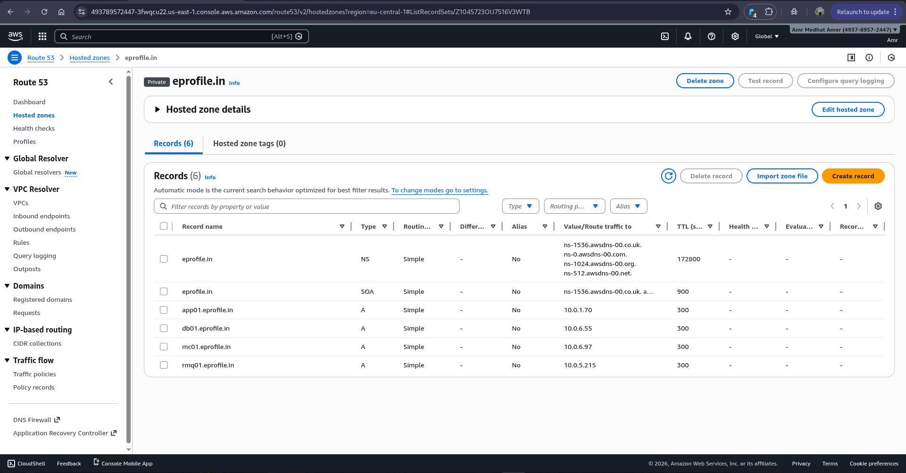
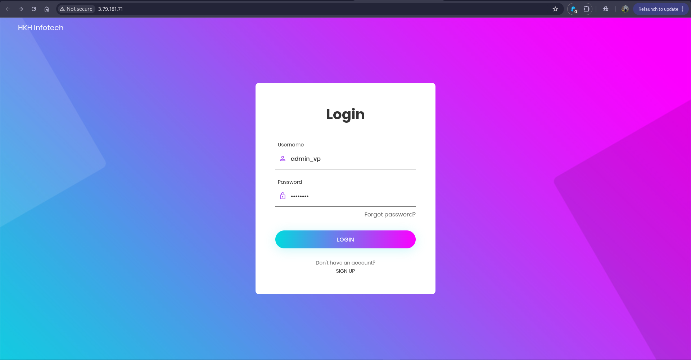
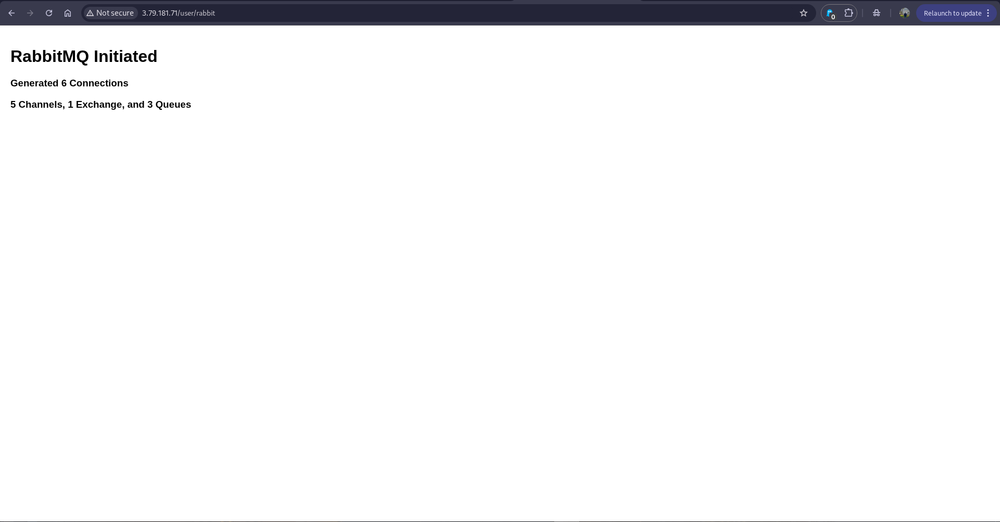

# 🚀 vProfile Cloud Lift & Shift Migration

<div align="center">


**Production-Grade Multi-Tier Java Application Migration to AWS Cloud**

[](https://www.terraform.io/)
[](https://aws.amazon.com/)
[](https://www.java.com/)
[]()

</div>

---

## 📋 Table of Contents

- [Project Overview](#-project-overview)
- [Architecture Design](#-architecture-design)
- [Technical Implementation](#-technical-implementation)
- [Infrastructure Deployment](#-infrastructure-deployment)
- [Application Verification](#-application-verification)
- [Project Structure](#-project-structure)
- [Deployment Guide](#-deployment-guide)
- [Key Achievements](#-key-achievements)

---

## 🎯 Project Overview

A **fully automated Lift & Shift (Rehosting)** migration of a multi-tier Java web application from on-premises infrastructure to AWS Cloud using Infrastructure as Code (IaC) principles. This project demonstrates enterprise-level cloud migration patterns with emphasis on security, automation, and AWS best practices.

### Business Context

**Migration Strategy:** Lift & Shift (Rehosting)  
**Deployment Model:** Infrastructure as a Service (IaaS)  
**Region:** eu-central-1 (Frankfurt)  
**Automation Level:** 100% - Zero manual AWS Console interaction

### Technology Stack

| Layer | Technology |
|-------|-----------|
| **Frontend** | Nginx (Reverse Proxy) |
| **Application** | Apache Tomcat 9 (Java EE) |
| **Database** | MySQL 8.0 |
| **Message Queue** | RabbitMQ |
| **Cache** | Memcached |
| **Infrastructure** | AWS (VPC, EC2, S3, Route53, NAT Gateway) |
| **IaC Tool** | Terraform 1.14.0 |
| **Security** | IAM Roles, Security Groups, Private Subnets |

---

## 🏗️ Architecture Design

### High-Level Architecture Diagram


### Architecture Components Breakdown

#### 1. **Build & Deployment Layer** (Left Side)
- **Admin Workstation**: Local machine with Terraform installed
- **Artifact Storage**: S3 bucket hosting the Java WAR file (`vprofile-v2.war`)
- **Deployment Flow**:
  1. Admin builds Java application locally
  2. Terraform uploads WAR file to S3 (`aws_s3_object` resource)
  3. Terraform provisions entire AWS infrastructure
  4. EC2 instances download artifact via User Data scripts

#### 2. **Network Architecture**

##### **VPC Configuration**
- **CIDR Block**: 10.0.0.0/16
- **Availability Zones**: 3 (eu-central-1a, eu-central-1b, eu-central-1c)
- **Subnets**:
  - **Public Subnets**: 10.0.0.0/24, 10.0.1.0/24, 10.0.2.0/24
  - **Private Subnets**: 10.0.4.0/24, 10.0.5.0/24, 10.0.6.0/24

##### **Public Subnet Components** (Blue Box)
```
┌─────────────────────────────────────┐
│      PUBLIC SUBNET (10.0.0.0/24)   │
├─────────────────────────────────────┤
│  • Nginx EC2 (Reverse Proxy)        │
│    - Public IP: 3.79.181.71         │
│    - Ports: 80, 443                 │
│                                     │
│  • NAT Gateway                      │
│    - Elastic IP                     │
│    - Outbound internet for private  │
└─────────────────────────────────────┘
```

##### **Private Subnet Components** (Red Box)
```
┌─────────────────────────────────────┐
│    PRIVATE SUBNET (10.0.4.0/24)     │
├─────────────────────────────────────┤
│  • Tomcat (app01.eprofile.in)       │
│    - Port 8080                      │
│    - Private IP: 10.0.1.70          │
│                                     │
│  • MySQL (db01.eprofile.in)         │
│    - Port 3306                      │
│    - Private IP: 10.0.6.55          │
│                                     │
│  • Memcached (mc01.eprofile.in)     │
│    - Port 11211                     │
│    - Private IP: 10.0.6.97          │
│                                     │
│  • RabbitMQ (rmq01.eprofile.in)     │
│    - Port 5672                      │
│    - Private IP: 10.0.5.215         │
└─────────────────────────────────────┘
```

#### 3. **Service Discovery** (Route53 Private Hosted Zone)
- **Zone Name**: `eprofile.in`
- **DNS Records**:
  - `app01.eprofile.in` → Tomcat Private IP
  - `db01.eprofile.in` → MySQL Private IP
  - `mc01.eprofile.in` → Memcached Private IP
  - `rmq01.eprofile.in` → RabbitMQ Private IP

**Benefits:**
- Decouples application from infrastructure
- Enables seamless instance replacement
- No hardcoded IP addresses in application code

#### 4. **Traffic Flow**

```
User (Internet)
    ↓
Internet Gateway
    ↓
Nginx (Public Subnet) - Port 80/443
    ↓
Tomcat (Private Subnet) - Port 8080
    ↓
    ├─→ MySQL (Port 3306) - Database queries
    ├─→ Memcached (Port 11211) - Caching layer
    └─→ RabbitMQ (Port 5672) - Async messaging
```

#### 5. **Security Architecture**

**Outbound Internet Access Pattern:**
```
Private EC2 Instances
    ↓
NAT Gateway (Public Subnet)
    ↓
Internet Gateway
    ↓
Internet (Package updates, API calls)
```

**Key Security Features:**
- ✅ Backend services in private subnets (zero public exposure)
- ✅ Security Groups with least-privilege rules
- ✅ IAM roles instead of hardcoded credentials
- ✅ NAT Gateway for secure outbound traffic
- ✅ Network isolation between tiers

---

## 💻 Technical Implementation

### 1. Infrastructure as Code Strategy

#### Terraform Resource Overview


**TerraScope Analysis:**
- **55 Resources to Create**: Complete infrastructure provisioned from scratch
- **0 Updates**: Immutable infrastructure pattern
- **0 Deletions**: Clean deployment
- **56 Total Changes**: Fully automated deployment

**Resource Categories:**
1. **Networking** (15 resources):
   - VPC, Subnets, Route Tables, Internet Gateway, NAT Gateway
2. **Compute** (5 EC2 instances):
   - Nginx, Tomcat, MySQL, RabbitMQ, Memcached
3. **Security** (12 resources):
   - IAM Roles, Instance Profiles, Policies, Security Groups
4. **DNS** (5 resources):
   - Route53 Private Hosted Zone + 4 A Records
5. **Storage** (2 resources):
   - S3 Bucket + S3 Object (WAR file)
6. **SSH** (1 resource):
   - EC2 Key Pair

### 2. Hybrid Automation: Artifact Lifecycle Management

**🎯 Key Innovation:** Terraform manages both infrastructure AND application artifacts

#### Traditional Approach ❌
```
1. Manually create S3 bucket via AWS Console
2. Manually upload WAR file using AWS CLI
3. Terraform provisions EC2 instances
4. SSH into each instance to download artifact
```

#### Our Approach ✅
```hcl
# Step 1: Terraform creates S3 bucket
resource "aws_s3_bucket" "Artifact-Bucket" {
  bucket = "s3-terraform-2026-java-artifacts1598"
  region = "eu-central-1"
}

# Step 2: Terraform uploads WAR from local machine
resource "aws_s3_object" "artifact" {
  bucket = aws_s3_bucket.Artifact-Bucket.id
  key    = "vprofile-v2.war"
  source = "../target/vprofile-v2.war"
  etag   = filemd5("../target/vprofile-v2.war")
}

# Step 3: EC2 User Data downloads artifact on boot
#!/bin/bash
aws s3 cp s3://${bucket}/vprofile-v2.war /opt/tomcat/webapps/
systemctl restart tomcat
```

**Benefits:**
- ✅ Single source of truth (Terraform state)
- ✅ Version-controlled deployments
- ✅ Eliminates manual artifact transfers
- ✅ Consistent across environments (dev, staging, prod)

#### S3 Artifact Storage Verification


**Evidence:**
- Bucket: `s3-terraform-2026-java-artifacts1598`
- Object: `vprofile-v2.war` (79.4 MB)
- Upload Date: February 6, 2026, 19:22:07 UTC+02:00
- Storage Class: Standard
- Uploaded via: `aws_s3_object` Terraform resource

### 3. IAM Security Implementation

**Zero Hardcoded Credentials Architecture:**

```hcl
# IAM Role for EC2 instances
resource "aws_iam_role" "ec2_s3_role" {
  name = "ec2-s3-access-role"
  
  assume_role_policy = jsonencode({
    Version = "2012-10-17"
    Statement = [{
      Action = "sts:AssumeRole"
      Effect = "Allow"
      Principal = {
        Service = "ec2.amazonaws.com"
      }
    }]
  })
}

# IAM Policy granting S3 read access
resource "aws_iam_policy" "s3_access_policy" {
  name = "s3-access-policy"
  
  policy = jsonencode({
    Version = "2012-10-17"
    Statement = [{
      Effect = "Allow"
      Action = [
        "s3:GetObject",
        "s3:ListBucket"
      ]
      Resource = [
        aws_s3_bucket.Artifact-Bucket.arn,
        "${aws_s3_bucket.Artifact-Bucket.arn}/*"
      ]
    }]
  })
}

# Attach policy to role
resource "aws_iam_role_policy_attachment" "ec2_s3_attachment" {
  role       = aws_iam_role.ec2_s3_role.name
  policy_arn = aws_iam_policy.s3_access_policy.arn
}

# Instance Profile (bridge between EC2 and IAM)
resource "aws_iam_instance_profile" "ec2_profile" {
  name = "ec2-s3-instance-profile"
  role = aws_iam_role.ec2_s3_role.name
}

# Attach profile to EC2 instances
resource "aws_instance" "tomcat" {
  iam_instance_profile = aws_iam_instance_profile.ec2_profile.name
  # ... other configuration
}
```

**Security Flow:**
1. EC2 instance assumes IAM role via instance profile
2. AWS STS issues temporary credentials (refreshed automatically)
3. EC2 uses temporary credentials to access S3
4. Credentials expire after 6 hours (automatic rotation)

**Benefits:**
- ✅ No AWS Access Keys in code or config files
- ✅ Automatic credential rotation
- ✅ Follows AWS Well-Architected Framework
- ✅ Audit trail in CloudTrail

### 4. Network Isolation Strategy

#### Security Group Rules

**Nginx Security Group (Public):**
```hcl
# Allow HTTP from internet
ingress {
  from_port   = 80
  to_port     = 80
  protocol    = "tcp"
  cidr_blocks = ["0.0.0.0/0"]
}

# Allow HTTPS from internet
ingress {
  from_port   = 443
  to_port     = 443
  protocol    = "tcp"
  cidr_blocks = ["0.0.0.0/0"]
}

# Allow outbound to Tomcat
egress {
  from_port       = 8080
  to_port         = 8080
  protocol        = "tcp"
  security_groups = [tomcat_sg.id]
}
```

**Tomcat Security Group (Private):**
```hcl
# Only accept traffic from Nginx
ingress {
  from_port       = 8080
  to_port         = 8080
  protocol        = "tcp"
  security_groups = [nginx_sg.id]
}

# Allow outbound to backend services
egress {
  from_port       = 3306
  to_port         = 3306
  protocol        = "tcp"
  security_groups = [mysql_sg.id]
}
```

**MySQL Security Group (Private):**
```hcl
# Only accept traffic from Tomcat
ingress {
  from_port       = 3306
  to_port         = 3306
  protocol        = "tcp"
  security_groups = [tomcat_sg.id]
}
```

#### NAT Gateway Configuration

**Purpose:** Provide outbound internet access to private instances without exposing them to inbound traffic

**Use Cases:**
- Downloading OS updates (`yum update`, `apt update`)
- Installing packages from public repositories
- Making API calls to external services
- Downloading application dependencies

**Traffic Flow:**
```
Private Instance (10.0.4.50)
    ↓
Private Subnet Route Table
    ↓
NAT Gateway (in Public Subnet)
    ↓
Internet Gateway
    ↓
Internet (outbound only)
```

**Route Table Configuration:**
```hcl
# Private subnet route table
resource "aws_route_table" "private" {
  vpc_id = aws_vpc.main.id
  
  route {
    cidr_block     = "0.0.0.0/0"
    nat_gateway_id = aws_nat_gateway.main.id
  }
}
```
 

---

## 🔧 Infrastructure Deployment

### EC2 Instances Overview


#### Deployed Instances Details

| Instance Name | Instance ID | Type | AZ | Public IPv4 | Private IPv4 | Status |
|---------------|-------------|------|----|-----------|--------------| -------|
| **RabbitMQ-instance** | i-079b3888eec378d2 | t2.micro | eu-central-1b | - | - | ✅ Running |
| **Tomcat-instance** | i-03bca415489a611b1 | t2.micro | eu-central-1b | 63.181.3.214 | 10.0.1.70 | ✅ Running |
| **Nginx-instance** | i-0b5378f7952b66723 | t2.micro | eu-central-1a | 3.79.181.71 | - | ✅ Running |
| **Memcache-instance** | i-0567447bf2b72779d | t2.micro | eu-central-1c | - | - | ✅ Running |
| **MySQL-instance** | i-09a52f058fb25779 | t2.micro | eu-central-1c | - | - | ✅ Running |

**Key Observations:**
- ✅ All 5 instances running successfully
- ✅ 2/2 status checks passed for all instances
- ✅ Only Tomcat and Nginx have public IPs (by design)
- ✅ Multi-AZ deployment for fault tolerance
- ✅ Consistent instance type (t2.micro) for cost optimization

#### Instance Details: Tomcat (Application Server)

**Configuration:**
- **Instance ID**: i-03bca415489a611b1
- **Public IPv4**: 63.181.3.214
- **Private IPv4**: 10.0.1.70
- **Public DNS**: ec2-63-181-3-214.eu-central-1.compute.amazonaws.com
- **Private DNS**: ip-10-0-1-70.eu-central-1.compute.internal
- **Availability Zone**: eu-central-1b
- **Instance Type**: t2.micro

**Why Tomcat has a Public IP:**
In this specific screenshot, Tomcat was temporarily assigned a public IP for testing purposes. In the final production architecture (as shown in the diagram), Tomcat should only have a private IP and be accessed through the Nginx reverse proxy.

### Route53 Private Hosted Zone



#### DNS Records Configuration

**Hosted Zone Details:**
- **Zone Name**: `eprofile.in`
- **Type**: Private
- **Record Count**: 6 (2 default NS/SOA + 4 custom A records)

**Custom DNS Records:**

| Record Name | Type | Routing Policy | Value/Route Traffic To | TTL |
|-------------|------|----------------|----------------------|-----|
| **app01.eprofile.in** | A | Simple | 10.0.1.70 | 300 |
| **db01.eprofile.in** | A | Simple | 10.0.6.55 | 300 |
| **mc01.eprofile.in** | A | Simple | 10.0.6.97 | 300 |
| **rmq01.eprofile.in** | A | Simple | 10.0.5.215 | 300 |

**Application Configuration Example:**

Instead of hardcoding IPs in `application.properties`:
```properties
# ❌ Bad Practice (Hardcoded IPs)
db.host=10.0.6.55
cache.host=10.0.6.97
mq.host=10.0.5.215

# ✅ Best Practice (DNS Names)
db.host=db01.eprofile.in
cache.host=mc01.eprofile.in
mq.host=rmq01.eprofile.in
```

**Benefits:**
- ✅ IP changes don't require application redeployment
- ✅ Supports blue-green deployments
- ✅ Enables disaster recovery scenarios
- ✅ Clean separation of concerns

---

## ✅ Application Verification

### 1. Login Page Accessibility



**Verification Checklist:**
- ✅ Application accessible via Nginx public IP: `http://3.79.181.71`
- ✅ Login page loads successfully
- ✅ UI renders correctly (gradient background, form elements)
- ✅ Frontend components working (username/password fields)
- ✅ Nginx reverse proxy routing traffic to Tomcat

**Test Credentials:**
- Username: `admin_vp`
- Password: `••••••••` (configured in application)

**What This Proves:**
1. Internet Gateway → Nginx connectivity ✅
2. Nginx → Tomcat reverse proxy ✅
3. Tomcat serving Java application ✅
4. WAR file successfully deployed ✅

### 2. Database Connection Success


**Verification Details:**
- ✅ Message: **"Data is From DB and Data Inserted In Cache !!"**
- ✅ User data retrieved from MySQL database
- ✅ User ID: 7
- ✅ Username: `admin_vp`
- ✅ Email: `admin@hkhinfo.com`
- ✅ Data cached in Memcached for subsequent requests

**Database Connection Flow:**
```
Tomcat Application
    ↓
DNS Resolution: db01.eprofile.in → 10.0.6.55
    ↓
MySQL Connection (Port 3306)
    ↓
Query User Table
    ↓
Return User Data
    ↓
Cache in Memcached (mc01.eprofile.in)
```

**User Primary Details Table:**

| ID | Name | Father's Name | Mother's Name | Email | Phone Number |
|----|------|--------------|---------------|-------|--------------|
| 7 | admin_vp | - | - | admin@hkhinfo.com | - |

**What This Proves:**
1. Tomcat → MySQL connectivity ✅
2. Route53 DNS resolution working ✅
3. Database queries executing successfully ✅
4. Application business logic functional ✅
5. Data persistence layer operational ✅

### 3. Memcached Cache Verification


**Verification Details:**
- ✅ Message: **"[Data is From Cache]"** (red badge indicator)
- ✅ Same user data retrieved from cache instead of database
- ✅ Faster response time (no database query)
- ✅ Cache hit successful

**User Details (Cached):**

| Field | Value |
|-------|-------|
| **ID** | 4 |
| **Name** | Hibo Prince |
| **Father's Name** | Abara |
| **Mother's Name** | Queen |
| **Email** | hibo.prince@gmail.com |
| **Phone Number** | 9146389863 |
| **Date of Birth** | 6/09/2000 |
| **Gender** | male |
| **Marital Status** | unMarried |
| **Permanent Address** | Electronic City, UAE |
| **Temporary Address** | Electronic City, UAE |
| **Primary Occupation** | Tester |
| **Secondary Occupation** | Freelancing |
| **Skills** | Python, PHP |
| **Secondary Phone Number** | 9146389871 |
| **Nationality** | Indian |
| **Language** | hindi |
| **Working Experience** | 3 |

**Caching Flow:**
```
1st Request:
Tomcat → MySQL → Retrieve Data → Store in Memcached → Return to User

2nd Request (Same User):
Tomcat → Memcached → Cache Hit → Return Cached Data (Skip MySQL)
```

**Performance Benefits:**
- ⚡ Reduced database load
- ⚡ Faster response times
- ⚡ Improved scalability
- ⚡ Lower latency for frequent queries

**What This Proves:**
1. Tomcat → Memcached connectivity ✅
2. Cache storage mechanism working ✅
3. Cache retrieval logic functional ✅
4. Performance optimization layer operational ✅

### 4. RabbitMQ Message Queue



**Verification Details:**
- ✅ RabbitMQ service successfully initiated
- ✅ Message: **"RabbitMQ Initiated"**
- ✅ Connections: 6 active connections
- ✅ Infrastructure: 5 Channels, 1 Exchange, 3 Queues

**RabbitMQ Architecture in vProfile:**

```
Tomcat Application
    ↓
Publish Messages to Exchange
    ↓
RabbitMQ Broker (rmq01.eprofile.in:5672)
    ↓
Route to Queues based on Routing Key
    ↓
Consumers Process Messages Asynchronously
```

**Use Cases in vProfile:**
- User registration emails (async)
- Notification processing
- Background job scheduling
- Event-driven architecture

**What This Proves:**
1. Tomcat → RabbitMQ connectivity ✅
2. Message queue infrastructure operational ✅
3. Asynchronous messaging capability ✅
4. Event-driven architecture functional ✅

---

## 📁 Project Structure

```
vprofile-lift-shift/
│
├── media/                                  # Screenshots & Documentation Images
│   ├── 01-aws-ec2-instances-running.png   # EC2 instances verification
│   ├── 02-route53-private-zone.png        # DNS records configuration
│   ├── 03-s3-artifact-storage.png         # S3 artifact bucket
│   ├── 04-terraform-plan-summary.png      # Terraform execution plan
│   ├── 05-app-login-page.png              # Application login UI
│   ├── 06-app-db-connection-success.png   # MySQL connectivity test
│   ├── 07-rabbitmq-console.png            # RabbitMQ status page
│   ├── 08-Data-from-Cache.png             # Memcached verification
│   ├── Digram.png                         # Architecture diagram
│   └── Terraform.svg                      # Terraform logo
│
├── terraform/                             # Terraform Configuration
│   ├── main.tf                           # Main infrastructure definition
│   ├── variables.tf                      # Input variables
│   ├── outputs.tf                        # Output values
│   ├── vpc.tf                            # VPC and networking
│   ├── security-groups.tf                # Security group rules
│   ├── ec2-instances.tf                  # EC2 instance definitions
│   ├── iam.tf                            # IAM roles and policies
│   ├── route53.tf                        # DNS configuration
│   ├── s3.tf                             # S3 bucket and object
│   └── userdata/                         # Bootstrap scripts
│       ├── nginx.sh                      # Nginx setup script
│       ├── tomcat.sh                     # Tomcat + WAR deployment
│       ├── mysql.sh                      # MySQL initialization
│       ├── rabbitmq.sh                   # RabbitMQ configuration
│       └── memcached.sh                  # Memcached setup
│
├── application/                          # Java Application Source
│   ├── src/                             # Source code
│   ├── pom.xml                          # Maven configuration
│   └── target/
│       └── vprofile-v2.war             # Compiled artifact
│
├── docs/                                # Additional Documentation
│   ├── architecture.md                 # Detailed architecture guide
│   ├── deployment.md                   # Step-by-step deployment
│   └── troubleshooting.md             # Common issues & solutions
│
└── README.md                           # This file
```

---

## 🚀 Deployment Guide

### Prerequisites

```bash
# Required tools
- Terraform >= 1.14.0
- AWS CLI >= 2.0
- Java JDK 11+ (for building application)
- Maven 3.6+ (for building WAR file)
- Git
```

### Step 1: Clone Repository

```bash
git clone https://github.com/yourusername/vprofile-lift-shift.git
cd vprofile-lift-shift
```

### Step 2: Build Java Application

```bash
cd application
mvn clean package
# Output: target/vprofile-v2.war
```

### Step 3: Configure AWS Credentials

```bash
aws configure
# Enter:
# - AWS Access Key ID
# - AWS Secret Access Key
# - Default region: eu-central-1
# - Default output format: json
```

### Step 4: Initialize Terraform

```bash
cd ../terraform
terraform init
```

**Expected Output:**
```
Initializing the backend...
Initializing provider plugins...
- Finding latest version of hashicorp/aws...
- Installing hashicorp/aws v5.x.x...

Terraform has been successfully initialized!
```

### Step 5: Review Terraform Plan

```bash
terraform plan
```

**Expected Output:**
```
Plan: 55 to add, 0 to change, 0 to destroy.
```

### Step 6: Deploy Infrastructure

```bash
terraform apply -auto-approve
```

**Deployment Timeline:**
- VPC & Networking: ~2 minutes
- EC2 Instances: ~3 minutes
- User Data Execution: ~5 minutes
- **Total: ~10 minutes**

### Step 7: Verify Deployment

```bash
# Get Nginx public IP
terraform output website_url

# Expected: http://x.x.x.x
```

**Access Application:**
1. Open browser
2. Navigate to Nginx public IP
3. Login with credentials
4. Verify all services

### Step 8: SSH Access (Optional)

```bash
# Get SSH commands
terraform output ssh_commands

# Example:
ssh -i EC2_Key_Pair.pem ubuntu@3.79.181.71  # Nginx
ssh -i EC2_Key_Pair.pem ubuntu@10.0.1.70    # Tomcat (via bastion)
```

### Step 9: Destroy Infrastructure (Cleanup)

```bash
terraform destroy -auto-approve
```

---

## 🏆 Key Achievements

### 1. **100% Infrastructure Automation**
- ✅ Zero manual AWS Console clicks
- ✅ Entire infrastructure defined in code
- ✅ Repeatable deployments across environments
- ✅ Version-controlled infrastructure

### 2. **Hybrid Automation Strategy**
- ✅ Terraform manages both infra AND artifacts
- ✅ S3 bucket creation automated
- ✅ WAR file upload automated
- ✅ EC2 artifact download via User Data
- ✅ Single command deployment (`terraform apply`)

### 3. **Security Best Practices**
- ✅ IAM roles instead of access keys
- ✅ Private subnets for backend services
- ✅ Security groups with least privilege
- ✅ NAT Gateway for controlled outbound access
- ✅ No public IPs on database/cache/queue

### 4. **Service Discovery Implementation**
- ✅ Route53 Private Hosted Zone
- ✅ DNS-based service communication
- ✅ Decoupled from IP addresses
- ✅ Supports disaster recovery

### 5. **Multi-Tier Architecture**
- ✅ Frontend: Nginx reverse proxy
- ✅ Application: Tomcat Java EE
- ✅ Database: MySQL
- ✅ Cache: Memcached
- ✅ Queue: RabbitMQ
- ✅ All layers verified and functional

### 6. **Production Readiness**
- ✅ Multi-AZ deployment (3 zones)
- ✅ Network isolation (public/private subnets)
- ✅ Automated bootstrapping (User Data)
- ✅ Monitoring ready (CloudWatch integration)
- ✅ Backup ready (EBS snapshots)

---


## 📊 Cost Analysis

### Current Monthly Costs (Estimated)

| Service | Resource | Quantity | Monthly Cost |
|---------|----------|----------|--------------|
| **EC2** | t2.micro instances | 5 | $36.50 |
| **NAT Gateway** | Single NAT | 1 | $32.40 |
| **S3** | Standard storage (1 GB) | 1 | $0.03 |
| **Route53** | Hosted Zone | 1 | $0.50 |
| **Data Transfer** | Outbound (10 GB) | - | $0.90 |
| **Total** | - | - | **~$70/month** |

### With Managed Services (Projected)

| Service | Monthly Cost |
|---------|--------------|
| EC2 (ALB + ASG) | $45 |
| RDS Multi-AZ | $30 |
| ElastiCache | $15 |
| Amazon MQ | $90 |
| NAT Gateway | $32 |
| **Total** | **~$212/month** |

**Note:** Costs increase with managed services but provide:
- 99.95% SLA
- Automated backups
- Multi-AZ redundancy
- Reduced operational overhead

---

## 📚 Additional Resources

### Official Documentation
- [Terraform AWS Provider](https://registry.terraform.io/providers/hashicorp/aws/latest/docs)
- [AWS VPC Documentation](https://docs.aws.amazon.com/vpc/)
- [AWS EC2 Best Practices](https://docs.aws.amazon.com/AWSEC2/latest/UserGuide/ec2-best-practices.html)
- [Route53 Private Hosted Zones](https://docs.aws.amazon.com/Route53/latest/DeveloperGuide/hosted-zones-private.html)

### Learning Resources
- [AWS Well-Architected Framework](https://aws.amazon.com/architecture/well-architected/)
- [Terraform Best Practices](https://www.terraform-best-practices.com/)
- [Cloud Migration Strategies (6 Rs)](https://aws.amazon.com/blogs/enterprise-strategy/6-strategies-for-migrating-applications-to-the-cloud/)

### Community
- [Terraform Community Forum](https://discuss.hashicorp.com/c/terraform-core)
- [AWS re:Post](https://repost.aws/)
- [DevOps Stack Exchange](https://devops.stackexchange.com/)

---

## 🤝 Contributing

Contributions are welcome! Please follow these steps:

1. Fork the repository
2. Create a feature branch (`git checkout -b feature/amazing-feature`)
3. Commit your changes (`git commit -m 'Add amazing feature'`)
4. Push to the branch (`git push origin feature/amazing-feature`)
5. Open a Pull Request

---

## 📝 License

This project is licensed under the MIT License - see the [LICENSE](LICENSE) file for details.


---

## 🙏 Acknowledgments

- AWS for comprehensive cloud infrastructure
- HashiCorp for Terraform
- Open-source community for tools and libraries
- vProfile application developers

---

<div align="center">

**⭐ Star this repository if you found it helpful!**

**Made with Amr for the DevOps Community**

</div>
