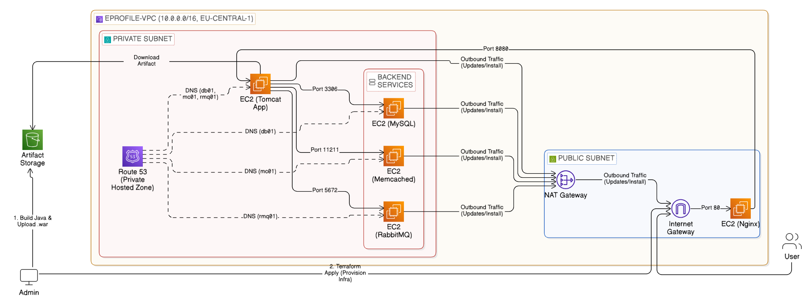
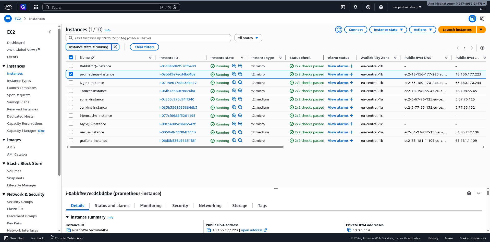
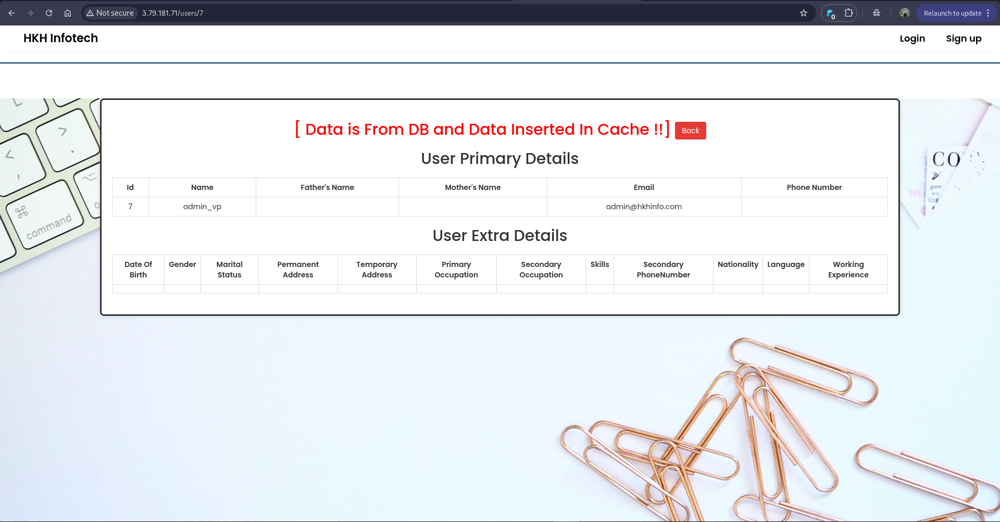
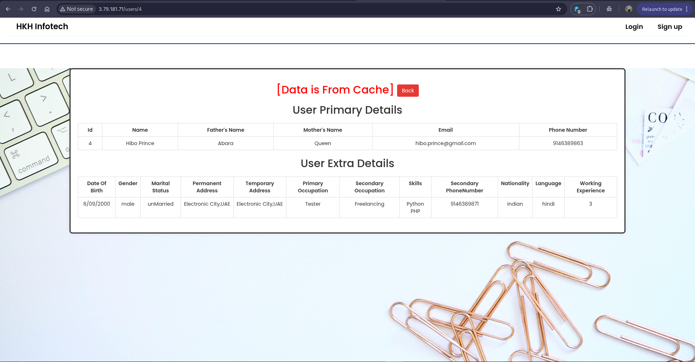

# 🌋 Strata-Ops: The Outer Core

## AWS Lift & Shift - Breaking Through to the Cloud

> *From the depths of local infrastructure, we ascend to the cloud. Same architecture, different world.*

<div align="center">

[](https://www.terraform.io/)
[](https://aws.amazon.com/)
[]()

</div>

---

## 🎯 The Leap

You've mastered the Inner Core - manual provisioning, automated scripts, local VMs. Now we **migrate that exact architecture to AWS**, transforming local knowledge into cloud power.

**This is Lift & Shift (Rehosting):** Same services, same relationships, cloud infrastructure.

### The Evolution Journey

```
Inner Core (Manual)          → Commands, SSH, local VMs
Inner Core (Automated)       → Shell scripts, Vagrant
Outer Core (Lift & Shift)    → Terraform, AWS, IaC     ← YOU ARE HERE
The Mantle (Containerized)   → Docker, orchestration
The Crust (Cloud Native)     → Serverless, managed services
```

### What Changes?

| Local Infrastructure | AWS Cloud |
|---------------------|-----------|
| VirtualBox VMs | EC2 instances |
| Vagrant networking | VPC + Subnets |
| Host file DNS | Route53 Private Zone |
| Local storage | S3 buckets |
| Manual provisioning scripts | Terraform automation |

### What Stays The Same?

✅ 5-tier architecture (Nginx → Tomcat → MySQL/Memcached/RabbitMQ)  
✅ Application code (same Java WAR)  
✅ Service relationships  
✅ Configuration patterns  

---

## 🏗️ Cloud Architecture



### The Three Zones

#### 🌐 **Public Zone** (Internet-Facing)
```
Internet Gateway
    ↓
Nginx (3.79.181.71)
    ↓
Reverse Proxy → Tomcat
```

**Purpose:** Single entry point, SSL termination, load balancing

#### 🔒 **Private Zone** (Backend Services)
```
Tomcat (10.0.1.70)
    ↓
├─→ MySQL (db01.eprofile.in:3306)
├─→ Memcached (mc01.eprofile.in:11211)
└─→ RabbitMQ (rmq01.eprofile.in:5672)
```

**Purpose:** Isolated backend, zero public exposure, DNS-based discovery

#### 🚪 **NAT Gateway** (Outbound Access)
```
Private Instances
    ↓
NAT Gateway (Public Subnet)
    ↓
Internet (yum/apt updates only)
```

**Purpose:** Secure outbound traffic without exposing services

---

## 💡 Key Innovation: Hybrid Artifact Management

### The Challenge

Traditional approach separates infrastructure from application deployment:
1. Terraform creates infrastructure
2. Manual artifact upload to S3
3. SSH into instances to deploy

**Result:** Incomplete automation, manual steps, inconsistency

### Our Solution

**Terraform manages EVERYTHING - infrastructure AND artifacts**

```hcl
# Create S3 bucket
resource "aws_s3_bucket" "artifacts" {
  bucket = "terraform-java-artifacts-1598"
}

# Upload WAR from local machine
resource "aws_s3_object" "app" {
  bucket = aws_s3_bucket.artifacts.id
  key    = "vprofile-v2.war"
  source = "../target/vprofile-v2.war"
  etag   = filemd5("../target/vprofile-v2.war")
}

# EC2 downloads on boot
resource "aws_instance" "tomcat" {
  user_data = <<-EOF
    #!/bin/bash
    aws s3 cp s3://${aws_s3_bucket.artifacts.id}/vprofile-v2.war /opt/tomcat/webapps/
    systemctl restart tomcat
  EOF
}
```

**Benefits:**
- ✅ One command deploys everything: `terraform apply`
- ✅ Version-controlled artifacts (etag tracks changes)
- ✅ No manual S3 uploads
- ✅ Repeatable across environments


---

## 🔐 Security Architecture

### Zero Hardcoded Credentials

**Problem:** Storing AWS keys in code = security nightmare

**Solution:** IAM roles with temporary credentials

```hcl
# IAM Role (what can assume it)
resource "aws_iam_role" "ec2_s3" {
  assume_role_policy = jsonencode({
    Statement = [{
      Effect = "Allow"
      Principal = { Service = "ec2.amazonaws.com" }
      Action = "sts:AssumeRole"
    }]
  })
}

# IAM Policy (what it can do)
resource "aws_iam_policy" "s3_read" {
  policy = jsonencode({
    Statement = [{
      Effect = "Allow"
      Action = ["s3:GetObject", "s3:ListBucket"]
      Resource = [
        aws_s3_bucket.artifacts.arn,
        "${aws_s3_bucket.artifacts.arn}/*"
      ]
    }]
  })
}

# Attach role to EC2
resource "aws_instance" "tomcat" {
  iam_instance_profile = aws_iam_instance_profile.ec2_s3.name
}
```

**Flow:**
1. EC2 assumes role automatically
2. AWS issues temporary credentials (6-hour expiry)
3. EC2 accesses S3 using temp credentials
4. Credentials auto-rotate

**No keys. No secrets. Just roles.**

### Network Isolation

**Security Group Strategy:**

```
Nginx SG:
  Inbound:  0.0.0.0/0 → Port 80/443 (internet)
  Outbound: Tomcat SG → Port 8080

Tomcat SG:
  Inbound:  Nginx SG → Port 8080
  Outbound: MySQL/MC/RMQ SGs → Specific ports

MySQL SG:
  Inbound:  Tomcat SG → Port 3306
  Outbound: None (database doesn't initiate)
```

**Each tier only talks to necessary neighbors. Defense in depth.**

---

## 🗺️ Service Discovery: Route53 Private Zone


### DNS-Based Decoupling

**Instead of hardcoded IPs:**
```properties
# ❌ Fragile
db.host=10.0.6.55
cache.host=10.0.6.97
```

**Use DNS names:**
```properties
# ✅ Resilient
db.host=db01.eprofile.in
cache.host=mc01.eprofile.in
```

### Route53 Records

| DNS Name | IP Address | Purpose |
|----------|-----------|---------|
| app01.eprofile.in | 10.0.1.70 | Tomcat application |
| db01.eprofile.in | 10.0.6.55 | MySQL database |
| mc01.eprofile.in | 10.0.6.97 | Memcached cache |
| rmq01.eprofile.in | 10.0.5.215 | RabbitMQ queue |

**Why this matters:**
- Replace an instance? Update DNS. Application code unchanged.
- Blue-green deployments? Switch DNS pointer.
- Disaster recovery? Point DNS to backup region.

**DNS is your abstraction layer.**

---

## 🚀 Terraform in Action


### What Gets Created?

**55 resources in one `terraform apply`:**

- **15 Networking:** VPC, subnets, route tables, IGW, NAT Gateway
- **5 Compute:** EC2 instances (Nginx, Tomcat, MySQL, Memcached, RabbitMQ)
- **12 Security:** IAM roles, policies, security groups
- **5 DNS:** Route53 zone + 4 A records
- **2 Storage:** S3 bucket + WAR object
- **1 Access:** SSH key pair

**From zero to production in ~10 minutes.**

### Infrastructure as Code Benefits

```bash
# Deploy entire stack
terraform apply -auto-approve

# Modify one resource
vim ec2-instances.tf  # Change instance type
terraform apply       # Updates only that instance

# Destroy everything
terraform destroy -auto-approve
```

**Version control your infrastructure. Treat it like code.**


---

## ✅ Verification: The Proof

### 1. All Services Running



| Instance | Instance ID | AZ | Public IP | Private IP | Status |
|----------|------------|----|-----------|-----------| -------|
| Nginx | i-0b5378f7952b66723 | eu-central-1a | 3.79.181.71 | - | ✅ Running |
| Tomcat | i-03bca415489a611b1 | eu-central-1b | 63.181.3.214 | 10.0.1.70 | ✅ Running |
| MySQL | i-09a52f058fb25779 | eu-central-1c | - | 10.0.6.55 | ✅ Running |
| Memcached | i-0567447bf2b72779d | eu-central-1c | - | 10.0.6.97 | ✅ Running |
| RabbitMQ | i-079b3888eec378d2 | eu-central-1b | - | 10.0.5.215 | ✅ Running |

**Multi-AZ deployment for fault tolerance. Private IPs for backend security.**

### 2. Application Accessible


**Test:** `http://3.79.181.71`

✅ Nginx serving traffic  
✅ Reverse proxy routing to Tomcat  
✅ Java application deployed  
✅ Login page renders

### 3. Database Connected



**Message:** "Data is From DB and Data Inserted In Cache !!"

✅ Tomcat → MySQL connection  
✅ DNS resolution (`db01.eprofile.in`)  
✅ SQL queries executing  
✅ Data persisted and retrieved

### 4. Cache Working



**Message:** "[Data is From Cache]" (red badge)

✅ Memcached storing data  
✅ Cache hits reducing DB load  
✅ Performance optimization active

### 5. Message Queue Active


**Status:** "RabbitMQ Initiated"  
**Connections:** 6 active

✅ RabbitMQ broker running  
✅ Asynchronous messaging functional  
✅ Event-driven architecture ready

---

## 📋 Quick Start

### Prerequisites

```bash
# Install required tools
brew install terraform awscli maven  # macOS
# OR
sudo apt install terraform awscli maven  # Ubuntu
```

### Deploy in 4 Commands

```bash
# 1. Build application
cd application
mvn clean package

# 2. Configure AWS
aws configure  # Enter credentials, region: eu-central-1

# 3. Deploy infrastructure
cd ../terraform
terraform init
terraform apply -auto-approve

# 4. Access application
terraform output website_url
# Opens: http://<nginx-ip>
```

**Deployment time:** ~10 minutes  
**Cost:** ~$70/month (5x t2.micro + NAT Gateway)

### Destroy

```bash
terraform destroy -auto-approve
```

**Everything deleted. S3 bucket emptied. No orphaned resources.**

---

## 🎓 What You Learn Here

### Cloud Migration Principles

- ✅ **Lift & Shift strategy:** When and why to rehost
- ✅ **VPC design:** Public/private subnet patterns
- ✅ **Security groups:** Defense in depth
- ✅ **IAM best practices:** Roles over keys

### Terraform Mastery

- ✅ **Resource dependencies:** Implicit and explicit
- ✅ **State management:** Remote state (production-ready)
- ✅ **Module patterns:** DRY infrastructure
- ✅ **Lifecycle management:** Create, update, destroy

### AWS Services

- ✅ **EC2:** Instance types, user data, placement
- ✅ **VPC:** Subnets, route tables, gateways
- ✅ **Route53:** Private hosted zones, A records
- ✅ **S3:** Bucket policies, object versioning
- ✅ **IAM:** Roles, policies, instance profiles

### DevOps Practices

- ✅ **Infrastructure as Code:** Version control, peer review
- ✅ **Immutable infrastructure:** Replace, don't modify
- ✅ **Automation:** One-command deployments
- ✅ **Documentation as code:** README explains architecture

---

## 🔧 Common Issues

### Issue: Terraform state lock

**Symptom:** `Error acquiring the state lock`

**Solution:**
```bash
# Force unlock (use with caution)
terraform force-unlock <lock-id>
```

### Issue: NAT Gateway timeout

**Symptom:** Private instances can't download packages

**Solution:**
```bash
# Verify route table association
aws ec2 describe-route-tables --filters "Name=vpc-id,Values=<vpc-id>"

# Check NAT Gateway status
aws ec2 describe-nat-gateways --filter "Name=vpc-id,Values=<vpc-id>"
```

### Issue: S3 access denied

**Symptom:** EC2 can't download WAR file

**Solution:**
```bash
# Verify IAM role attachment
aws ec2 describe-instances --instance-ids <instance-id> \
  --query 'Reservations[0].Instances[0].IamInstanceProfile'

# Test from EC2
aws s3 ls s3://<bucket-name>/
```

---

## 📊 Cost Analysis

### Current Setup (Development)

| Service | Resource | Monthly Cost |
|---------|----------|--------------|
| EC2 | 5x t2.micro | $36.50 |
| NAT Gateway | 1x NAT | $32.40 |
| S3 | 1GB storage | $0.03 |
| Route53 | 1 hosted zone | $0.50 |
| Data Transfer | 10GB | $0.90 |
| **Total** | | **~$70/month** |

### Production Evolution (Next Steps)

| Upgrade | Cost Impact | Benefit |
|---------|------------|---------|
| ALB instead of single Nginx | +$16 | High availability, SSL termination |
| RDS Multi-AZ | +$30 | Automated backups, failover |
| ElastiCache | +$15 | Managed caching, scaling |
| Auto Scaling Groups | +$0 | Automatic scaling (EC2 costs vary) |

**Trade-off:** Higher cost for managed services = Lower operational burden

---

## 🎯 Next Layer: The Mantle

From VMs to containers. The **Dockerization & CI/CD** layer awaits, where we package this application into containers and automate the entire build-deploy pipeline.

**Same app. Portable, scalable, cloud-agnostic.**

---

## 💡 Pro Tips

**Cost Optimization:**
- 🔍 Use `t3.micro` instead of `t2.micro` for better performance
- 🕐 Stop instances during non-work hours (save ~50%)
- 📊 Enable Cost Explorer to track spending

**Security Hardening:**
- 🔐 Rotate IAM credentials regularly
- 🔒 Enable VPC Flow Logs
- 🛡️ Use AWS Systems Manager Session Manager (no SSH keys)
- 📝 Enable CloudTrail for audit logging

**Performance:**
- ⚡ Use Placement Groups for low latency
- 📦 Enable EBS optimization
- 🌐 Consider CloudFront for static assets

**Disaster Recovery:**
- 💾 Enable automated EBS snapshots
- 🗺️ Document failover procedures
- 🧪 Test restore process quarterly

---

## 📁 Project Structure

```
02-aws-lift-shift/
├── media/                     # Architecture diagrams, screenshots
│   ├── Digram.png            # Main architecture
│   ├── 01-aws-ec2-instances-running.png
│   ├── 02-route53-private-zone.png
│   ├── 03-s3-artifact-storage.png
│   ├── 04-terraform-plan-summary.png
│   ├── 05-app-login-page.png
│   ├── 06-app-db-connection-success.png
│   ├── 07-rabbitmq-console.png
│   ├── 08-Data-from-Cache.png
│   └── Terraform.svg
│
├── terraform/
│   ├── main.tf               # Provider configuration
│   ├── vpc.tf                # VPC, subnets, gateways
│   ├── security-groups.tf    # All security group rules
│   ├── ec2-instances.tf      # EC2 instance definitions
│   ├── iam.tf                # Roles, policies, instance profiles
│   ├── route53.tf            # Private hosted zone + records
│   ├── s3.tf                 # Artifact bucket + upload
│   ├── outputs.tf            # Public IPs, DNS names
│   ├── variables.tf          # Input variables
│   └── userdata/             # Bootstrap scripts
│       ├── nginx.sh
│       ├── tomcat.sh
│       ├── mysql.sh
│       ├── rabbitmq.sh
│       └── memcached.sh
│
└── README.md                 # This file
```

---

## 🔄 The Journey So Far

```
✅ Inner Core - Manual Setup
    ↓
✅ Inner Core - Automated Setup
    ↓
✅ Outer Core - AWS Lift & Shift    ← YOU ARE HERE
    ↓
⬜ The Mantle - Containerization
    ↓
⬜ The Crust - Cloud Native
```

**Each layer transforms. Each leap scales.**

---

<div align="center">

**☁️ The cloud is just someone else's computer. Make it yours.**

*Made with ascension for DevOps architects*

</div>
