# 🌋 Strata-Ops — Phase 2: AWS Lift & Shift + CI/CD + Observability

> **Built by [Amr Medhat Amer](https://github.com/amramer101) — Cloud & DevSecOps Engineer**
>
> *From the depths of local infrastructure, we ascend to the cloud — fully automated, zero manual steps.*

[](https://www.terraform.io/)
[](https://aws.amazon.com/)
[](https://www.jenkins.io/)
[](https://www.sonarqube.org/)
[](https://prometheus.io/)
[](https://grafana.com/)

---

## 🎯 What This Is

One `terraform apply`. Ten EC2 instances. A production Java application fully deployed, a complete CI/CD pipeline with security scanning and quality gates, and a real-time monitoring stack — all configured and talking to each other with zero manual intervention.

This is **Phase 2** of the Strata-Ops journey: taking the manually-provisioned multi-tier app from Phase 1 and rebuilding it on AWS with full automation, DevSecOps practices, and observability baked in from the start.

---

## 🏗️ Full Architecture

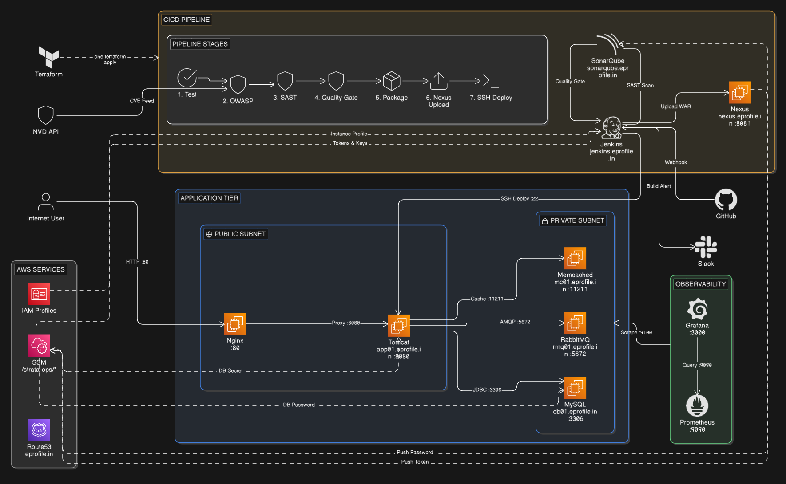

The system is organized into three independent layers wired together through **AWS SSM Parameter Store** as a secrets coordination bus and **Route53 Private DNS** as a service discovery layer.

---

## ☁️ Layer 1 — Application Tier

### The Request Journey

```
Internet User
      │
      ▼  HTTP :80
┌─────────────┐
│    Nginx    │  ← Public Subnet — Reverse Proxy
└─────────────┘
      │
      ▼  Proxy :8080
┌───────────────────────────────┐
│  Tomcat  (app01.eprofile.in)  │  ← Public Subnet — Java App Server
└───────────────────────────────┘
      │               │               │
      ▼ JDBC :3306    ▼ Cache :11211  ▼ AMQP :5672
┌──────────┐   ┌───────────┐   ┌──────────────┐
│  MySQL   │   │ Memcached │   │   RabbitMQ   │  ← Private Subnet
└──────────┘   └───────────┘   └──────────────┘
```

**Why private subnets for the backend?** MySQL, Memcached, and RabbitMQ have no reason to accept traffic from the internet. Placing them in private subnets means they have no public IP at all — even if a Security Group rule were misconfigured, there is no inbound route from the internet. They still reach the internet outbound through the NAT Gateway for package installation.

### Private DNS — The Decoupling Layer

Every internal service is referenced by DNS name, never by IP address.

| DNS Record | Service | Port |
|---|---|---|
| `app01.eprofile.in` | Tomcat | 8080 |
| `db01.eprofile.in` | MySQL | 3306 |
| `mc01.eprofile.in` | Memcached | 11211 |
| `rmq01.eprofile.in` | RabbitMQ | 5672 |
| `nexus.eprofile.in` | Nexus | 8081 |
| `sonarqube.eprofile.in` | SonarQube | 9000 |
| `jenkins.eprofile.in` | Jenkins | 8080 |

Tomcat's `setenv.sh` uses `RDS_HOSTNAME=db01.eprofile.in`. If the MySQL server is replaced and gets a new private IP, only the Route53 A record changes — Tomcat config is untouched. This is the abstraction layer that makes the system resilient to infrastructure changes.

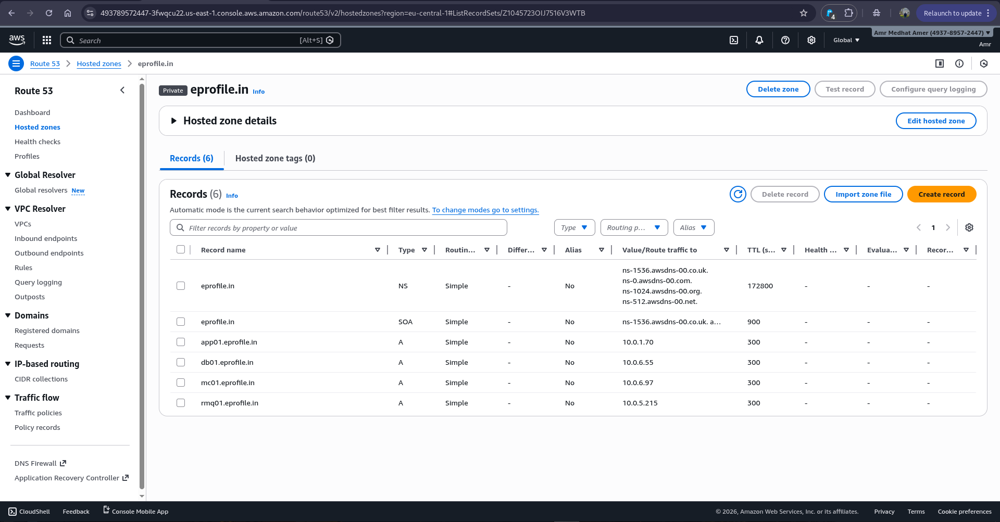

---

## ⚙️ Layer 2 — CI/CD Pipeline

### The 7-Stage Pipeline

Every push to `main` runs through the full pipeline automatically. The job is created by JCasC on Jenkins boot — no manual pipeline creation.


```
┌────────┐   ┌───────┐   ┌──────┐   ┌──────────────┐
│  Test  │──▶│ OWASP │──▶│ SAST │──▶│ Quality Gate │
└────────┘   └───────┘   └──────┘   └──────┬───────┘
                                            │ PASS only
                                            ▼
                           ┌─────────┐   ┌──────────────┐   ┌────────────┐
                           │ Package │──▶│ Nexus Upload │──▶│ SSH Deploy │──▶ Slack
                           └─────────┘   └──────────────┘   └────────────┘
```

**Stage 1 — Test:** `mvn test` runs all unit tests. Failure aborts immediately.

**Stage 2 — OWASP Dependency Check:** Scans every third-party library against the NVD CVE database using a live API key. Identifies known vulnerabilities in dependencies before they reach production. Reports are published as build artifacts.

**Stage 3 — SAST (SonarQube):** SonarScanner sends source code, compiled classes, test results, and coverage reports to SonarQube for static analysis — bugs, code smells, security hotspots, and coverage thresholds all checked.

**Stage 4 — Quality Gate:** Jenkins waits for SonarQube to return a verdict via webhook. If the gate fails, `abortPipeline: true` stops everything. Nothing gets deployed from code that doesn't meet the quality bar.

**Stage 5 — Package:** `mvn -DskipTests package` builds the `.war` (tests already ran in Stage 1).

**Stage 6 — Nexus Upload:** The WAR is uploaded to `vprofile-repo` under `QA/vprofile-v2/{BUILD_ID}/`. Every build has its own versioned artifact — rollback means pulling a previous build from Nexus.

**Stage 7 — SSH Deploy:** Jenkins SSHes into Tomcat using credentials stored in JCasC and fetched from SSM at boot. Stops Tomcat, swaps the WAR, restarts.

**Post — Slack:** Every outcome fires a colored notification to `#jenkins-cicd` with the build number and log link.

### Zero-Touch Jenkins — JCasC

Jenkins is never configured manually. The entire state — users, credentials, tool installations, pipeline definitions, SonarQube and Slack integrations — lives in `jenkins.yaml` committed to Git.

Sensitive values are environment variables injected at the systemd level from SSM. SSH keys for GitHub and Tomcat are multiline and cannot be env vars — `jenkins.sh` fetches them from SSM and appends them to the YAML with correct indentation before Jenkins starts.

---

## 🔐 Secrets Architecture — AWS SSM Parameter Store

No password appears in any committed file. SSM at `/strata-ops/*` is the single source of truth.

### Three Categories

**Generated by Terraform** — created once at `terraform apply`:
```
/strata-ops/mysql-password          ← random_password resource
/strata-ops/jenkins-admin-password  ← random_password resource
```

**Pushed by servers at runtime** — Terraform sets `"pending"`, servers overwrite after they boot:
```
/strata-ops/nexus-password    ← nexus.sh writes after password change
/strata-ops/sonar-token       ← sonar.sh writes after token generation
```

**External secrets** — provided at apply time or pre-existing:
```
/strata-ops/tomcat-ssh-key        ← EC2 private key for SSH deploy
/strata-ops/github-private-key    ← SSH key for repo access
/strata-ops/slack-token           ← Slack bot token
```

### The Wait Loop — Coordinating Boot Order

Jenkins starts after Nexus and SonarQube EC2s are created (`depends_on` in Terraform), but a running EC2 doesn't mean a running service. Nexus takes 3–5 minutes to fully initialize. `jenkins.sh` solves this with a polling function:

```bash
wait_for_ssm_param() {
  while true; do
    VAL=$(aws ssm get-parameter --name "$1" --with-decryption ...)
    if [[ "$VAL" != "pending" && -n "$VAL" ]]; then
      echo "$VAL" && break
    fi
    sleep 10
  done
}

NEXUS_PASS=$(wait_for_ssm_param "/strata-ops/nexus-password")
SONAR_TOK=$(wait_for_ssm_param "/strata-ops/sonar-token")
```

Jenkins polls SSM until Nexus and SonarQube have written their real values. Only then does it inject the environment variables and start. SSM becomes the coordination mechanism for the entire boot sequence.

### IAM — Least Privilege

Every EC2 has an IAM Instance Profile granting exactly one permission:

```hcl
actions   = ["ssm:PutParameter", "ssm:GetParameter", ...]
resources = ["arn:aws:ssm:*:*:parameter/strata-ops/*"]
```

Nothing broader. AWS issues temporary credentials automatically through the Instance Metadata Service — no access keys stored anywhere.

---

## 🚀 Boot Sequence — Full Orchestration

```
terraform apply
       │
       ├── VPC + Subnets + NAT + Route53 + IAM + SSM  ← all parallel
       │
       ├── App Stack  ← parallel
       │   ├── MySQL      → SSM: get password → seed DB from GitHub
       │   ├── Tomcat     → SSM: get password → write setenv.sh
       │   ├── Nginx      → wait for DNS → write nginx.conf
       │   ├── Memcached  → configure + start
       │   └── RabbitMQ   → configure + start
       │
       ├── CI Stack  ← parallel
       │   ├── Nexus      → boot (3-5 min) → change password → SSM: PUT nexus-password
       │   └── SonarQube  → boot → generate token → SSM: PUT sonar-token
       │                                   └→ create Jenkins webhook
       │
       ├── Jenkins  ← depends_on: Nexus + SonarQube EC2s
       │   ├── install Jenkins + all plugins
       │   ├── download jenkins.yaml from GitHub
       │   ├── WAIT: nexus-password != "pending"   (polls SSM)
       │   ├── WAIT: sonar-token   != "pending"   (polls SSM)
       │   ├── GET:  github-key, tomcat-key, admin-password
       │   ├── inject env vars into systemd override.conf
       │   ├── append SSH keys to jenkins.yaml
       │   └── start Jenkins → JCasC configures everything automatically
       │
       └── Monitoring  ← depends_on: Nginx + Tomcat + MySQL
           ├── Prometheus → write prometheus.yml with DNS targets → start
           └── Grafana    → depends_on: Prometheus
                          → provision datasource YAML → start → Prometheus pre-connected
```

**Total time: ~15–20 minutes.** Nexus and SonarQube are the bottleneck.

---

## 📊 Layer 3 — Observability

### All 10 Instances Running

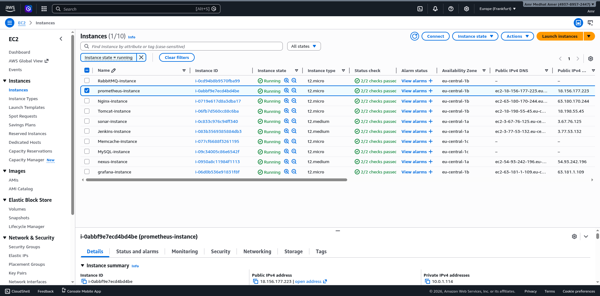

All servers across `eu-central-1a`, `eu-central-1b`, and `eu-central-1c` — 2/2 status checks passed on every instance.

### Prometheus — 5/5 Targets UP

Prometheus scrapes Node Exporter on port 9100 from all application servers every 15 seconds. The Security Group for port 9100 only allows traffic from the Prometheus Security Group — no other source can query the metrics endpoints.

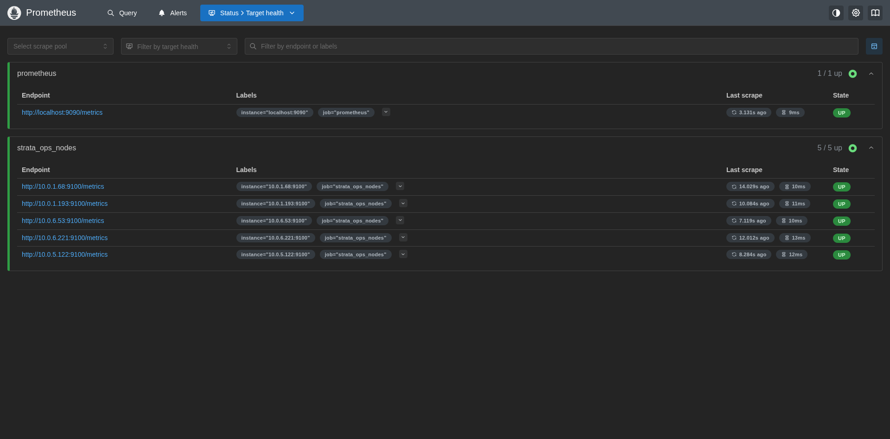

All 5 targets in the `strata_ops_nodes` job are UP: Nginx, Tomcat, MySQL, Memcached, and RabbitMQ — each identified by private IP.

### Grafana — Per-Server Dashboards

The Prometheus datasource is provisioned automatically on first boot via `/etc/grafana/provisioning/datasources/prometheus.yml`. No manual "Add datasource" step. The Node Exporter Full dashboard gives complete visibility into every server.

**MySQL — CPU 0.2%, RAM 42.4%, Disk 35.6%:**

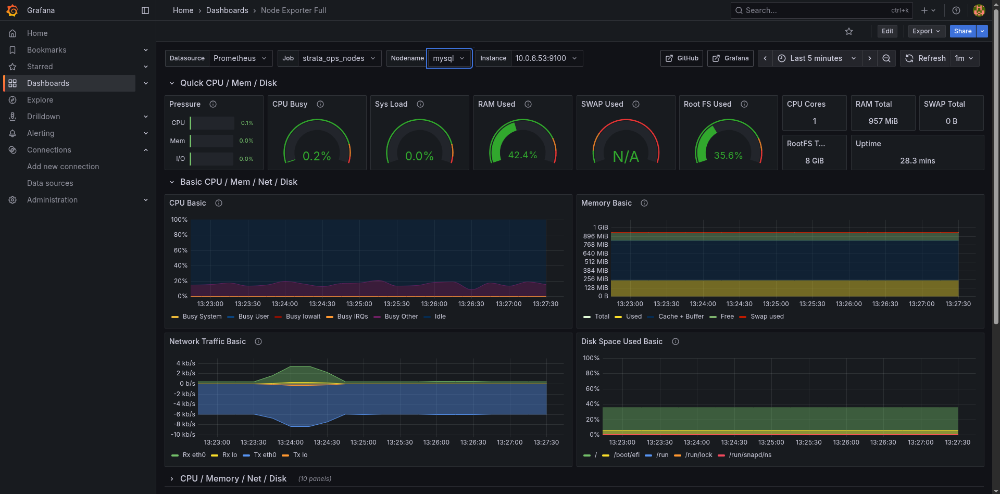

**Tomcat — CPU 0.4%, RAM 66.6%, Disk 42.2%:**

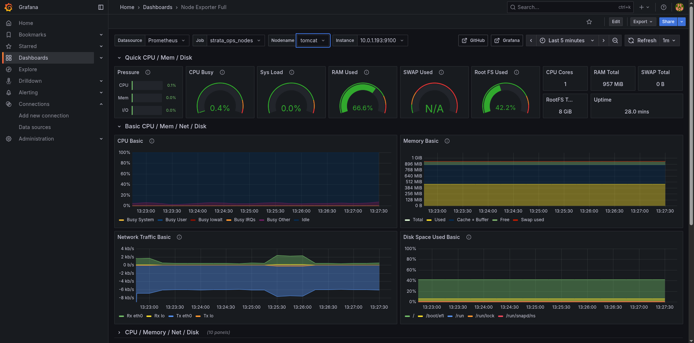

Tomcat's higher RAM usage (66.6% vs MySQL's 42.4%) is expected — the JVM allocates a large heap upfront. This baseline visibility is what lets you immediately spot anomalies when something goes wrong.

---

## 🔒 Network Security — Port Map

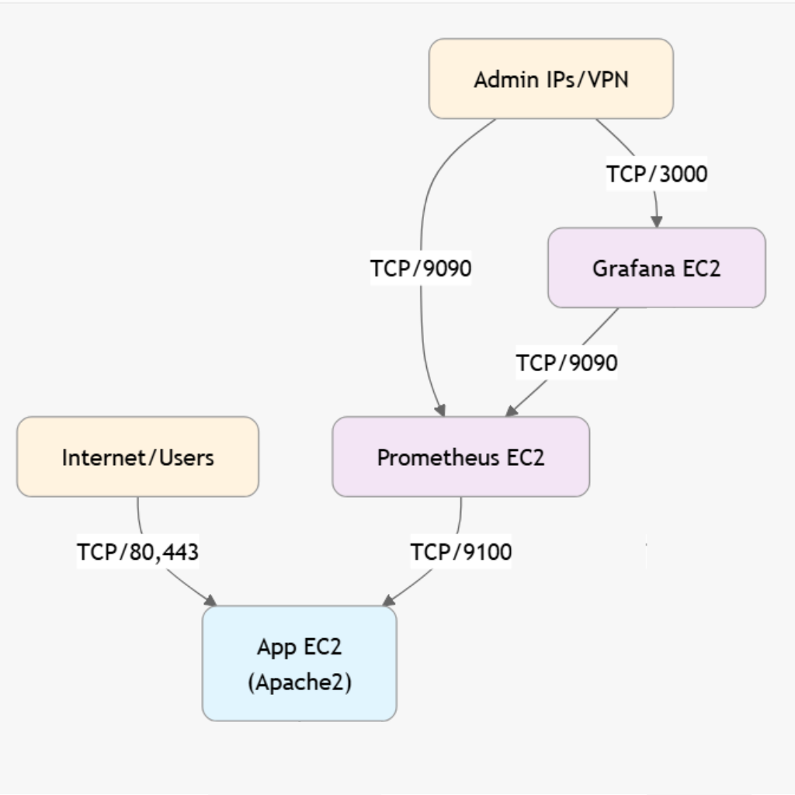

Security Groups use **referenced SG rules** for all internal traffic — not CIDR blocks. When Tomcat-SG says "accept 3306 from Tomcat-SG", only instances literally inside that Security Group can connect, not any IP in any range. Key rules:

- Port **80** → open to internet (Nginx entry point)
- Port **8080** → Tomcat accepts from Frontend-SG only; Jenkins accepts from public (required for webhooks)
- Port **9100** → only from Prometheus-SG
- Port **9090** → only from Grafana-SG + admin IP
- Ports **3306, 11211, 5672** → only from Tomcat-SG

---

## ✅ Application Verification

**Login page** — Nginx serving, reverse proxy routing to Tomcat, Java app initialized:

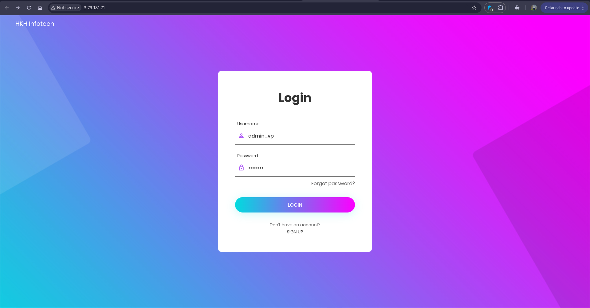

**First request** — "Data is From DB and Data Inserted In Cache": confirms Tomcat → MySQL → Memcached full chain is working:

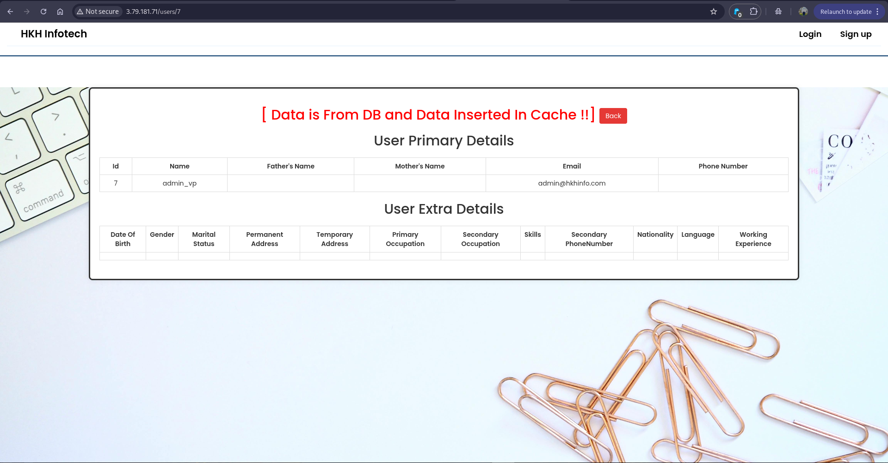

**Second request** — "Data is From Cache": Memcached hit, database load reduced:

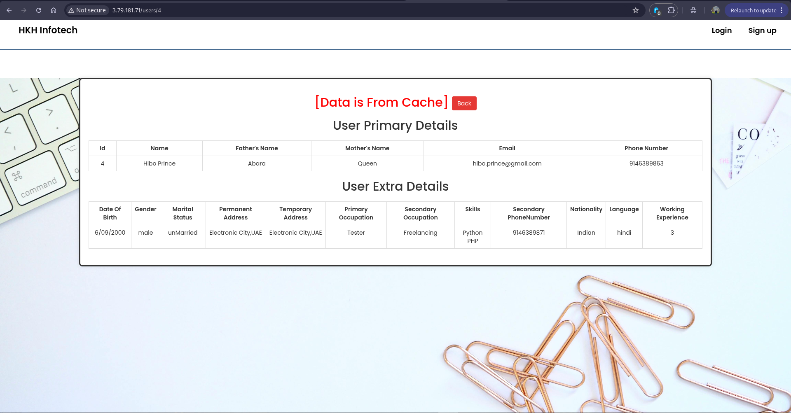

**RabbitMQ** — 6 active connections, async messaging layer operational:

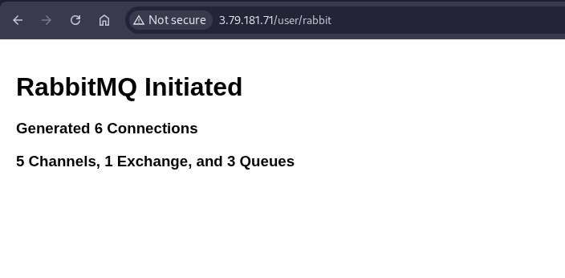

---

## 🐛 Real Bug — Debugging in Production

**Symptom:** Jenkins stuck in the SSM wait loop after `terraform apply`. `nexus-password` still `"pending"` after 10 minutes.

**Investigation:**
```bash
# SSH into Nexus
sudo cat /var/log/cloud-init-output.log | tail -50
```

Showed: `Password changed!` then immediately `Unknown options:` from the AWS CLI.

```bash
sudo cat /var/lib/cloud/instance/scripts/part-001 | grep -A 6 "put-parameter"
```

```bash
aws ssm put-parameter \
  --name "/strata-ops/nexus-password" \
  --value "admin123" \     ← trailing spaces after backslash
  --type "SecureString" \
```

**Root cause:** Bash line continuation (`\`) breaks silently with any whitespace after it. The `--value` argument was malformed. One invisible character caused the entire SSM write to fail.

**Fix:** Remove trailing spaces. Jenkins completed its bootstrap within seconds.

**Lesson:** `cloud-init-output.log` is your first stop for any userdata failure. It shows the full stdout/stderr of your bootstrap script exactly where it stopped.

---

## 🚀 Deploy

### Prerequisites

```bash
# Generate key pairs in the terraform/ directory
ssh-keygen -t rsa -b 4096 -f terraform/ec2-eprofile-key   # App stack
ssh-keygen -t rsa -b 4096 -f terraform/ci-key             # CI stack
ssh-keygen -t rsa -b 4096 -f terraform/monitor-key        # Monitoring stack
ssh-keygen -t ed25519 -f terraform/aws-2-github           # GitHub deploy key

# Create S3 bucket for remote state
aws s3 mb s3://s3-terraform-2026 --region eu-central-1
```

### Apply

```bash
cd 02-aws-lift-shift/terraform
terraform init
terraform apply -var="slack-token=YOUR_TOKEN"
```

Outputs on completion:

```
jenkins_ip    = "http://3.77.53.132:8080"
nexus_ip      = "http://54.93.242.196:8081"
sonar_ip      = "http://3.67.76.125:9000"
prometheus_ip = "http://18.156.177.223:9090"
grafana_ip    = "http://63.181.1.109:3000"
website_url   = "http://63.180.170.244"
```

### Destroy

```bash
terraform destroy -var="slack-token=x"
```

Everything deleted. No orphaned resources.

---

## 📁 Structure

```
02-aws-lift-shift/
│
├── Jenkinsfile                     # 7-stage pipeline definition
├── README.md
│
├── terraform/
│   ├── main.tf                     # 10 EC2 instance definitions
│   ├── vpc.tf                      # VPC, subnets, NAT, Route53
│   ├── secgrp.tf                   # Security Groups — all tiers
│   ├── iam.tf                      # IAM Role + Instance Profile
│   ├── ssm.tf                      # SSM Parameter definitions
│   ├── keypairs.tf                 # 3 key pairs
│   ├── variables.tf
│   ├── output.tf                   # All service URLs
│   ├── backend-state.tf            # S3 remote state
│   └── templates/
│       ├── setup-prometheus.sh     # Prometheus with DNS targets
│       └── Grafana.sh              # Grafana with auto-provisioned datasource
│
└── userdata-EC2/
    ├── jenkins.sh                  # Install + plugin + SSM wait + JCasC bootstrap
    ├── jenkins.yaml                # Full Jenkins config as code
    ├── nexus.sh                    # Install + password change + SSM push
    ├── sonar.sh                    # Install + token gen + webhook + SSM push
    ├── tomcat_ubuntu.sh            # Tomcat 10 + Java 21 + SSM fetch
    ├── nginx.sh                    # Nginx + DNS wait + reverse proxy
    ├── mysql.sh                    # MariaDB + SSM fetch + DB seed
    ├── rabbitmq.sh                 # RabbitMQ + Erlang
    ├── memcache.sh                 # Memcached + Node Exporter
    └── setup-prometheus.sh         # Prometheus with DNS-based targets
```

---

## 📈 The Evolution Journey

```
✅ Phase 1 — Manual Setup        local VMs, manual commands
✅ Phase 1 — Automated Setup     shell scripts, Vagrant
✅ Phase 2 — AWS Lift & Shift    Terraform, EC2, CI/CD, Monitoring   ← YOU ARE HERE
⬜ Phase 3 — Containerization    Docker, orchestration
⬜ Phase 4 — Cloud Native        EKS, managed services
```

---

<div align="center">

Built by **[Amr Medhat Amer](https://github.com/amramer101)** — Cloud & DevSecOps Engineer

*One command. Ten servers. Zero manual steps.*

</div>